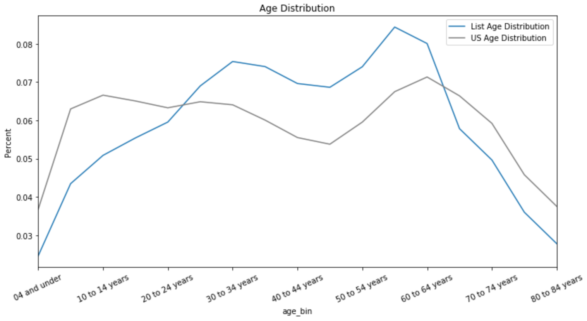

## This notebook is "inspired" (ie mostly copied) from Cameron David Pilon's Screencast on [Predicting Ages from First Names](https://dataorigami.net/collections/statistics-and-probability/products/determining-ages-using-first-name-data) which walks through his package [demographica](https://github.com/CamDavidsonPilon/demographica). One thing the screencast doesn't do is walk through the data-wrangling, so I'll do that here.

## The point of this package is to take a list of first names and show the distribution by "Age Bin" (image below)

* Dataset is from catalog.data.gov, specifically [Baby Names from Social Security Card Applications](https://catalog.data.gov/dataset/baby-names-from-social-security-card-applications-national-level-data)
* We're using the [Law of Total Probability](https://en.wikipedia.org/wiki/Law_of_total_probability) to determine the age distribution of customers by their first name. This is helped by the fact that names tend to go in and out of style. For example (granted, it is an extreme example), 70% of girls with the name "Brittany" are between 25 and 34 yrs old (as of April 27, 2020).
* The Law of Total Probability is defined as the equation below where: 

    * P(name) is the probabilty of a given name (ie sum(quanity of people with name X) / sum(total quantity))
    * P(Age Bin | name) is the probability of an age bin given the name x (ie sum(quantity of name x in age bin z) / sum(quantity people with name x))
    * P(Age bin | name) P(name) = sum(quantity of quantity name x in bin) / sum(total quantity)

## How to use
1. If you have cloned / copied this and don't have any data, first run `python DataLoader.py` to download and unzip the necessary data
2. Once you have the data, open the `age_by_name` notebook and run the cells. 
3. The `./data` directory has a `first_names.csv` file that can be used to test the `age_calculator` function